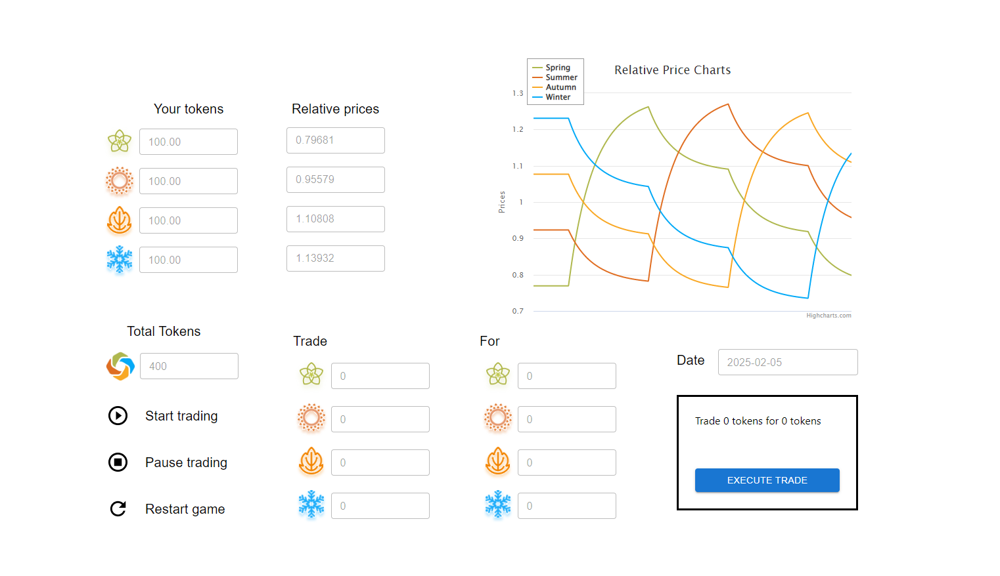

# Trading Game

## Available Scripts

In the project directory, you can run:

### `npm start`
### `npm test`
### `npm run build`
### `npm run eject`

## Learn More

### Introduction:

There are four tokens, Spring, Summer, Autumn and Winter, and the player has a balance for each token. The prices of the tokens change over time, and the player can trade tokens of one type for tokens of another type. The goal is to accumulate as many tokens as possible.

Each user starts off with 100 Spring tokens, 100 Summer tokens, 100 Autumn tokens and 100 Winter tokens. The total number of tokens, 400 at the start, is displayed below.

The game runs for 10 simulated years. The days tick by, one by one, taking 30 seconds to complete each year, with the total running time lasting 5 minutes. The game starts on the 5th of September, 2021, and ends on the 5th of September, 2031.

A price chart in the top right of the screen shows the last three years of prices and updates as time passes. Every day, the prices of the four tokens update according to the algorithm specified below. The user can trade tokens of one type for tokens of another type by using the trading interface. 

Three clicks are necessary to perform a trade. For example, to trade Spring for Summer, the user would click on Spring, then Summer, then Execute Trade. After each trade, the token balances update.

### Interface:

An outline of the interface is shown below.

The user can start, pause, or restart the game by clicking on the buttons on the bottom left.

When the game has started, the Date and Relative Prices fields update every time a day passes. The chart also updates.

If the user clicks on one of the token logos underneath where it says “Trade”, then the text box next to the logo gets populated with the user’s balance for that token.

If the user clicks on one of the token logos underneath where it says “for”, then the text box next to the logo gets populated with the number of tokens that the user can obtain in the trade. This is calculated based on the relative prices. For example, if the relative price for Spring is 2, and the relative price for Autumn is 1, then the user can get 2 Autumn tokens for 1 Spring token.

After the user has selected the tokens to trade, a box appears in the bottom right showing the details of the trade, e.g. Trade 1 Spring token for 2 Autumn tokens. The user can complete the trade by clicking on the Execute Trade button inside the box.

The prices, and the number of tokens that the user will receive for completing the trade, should continue to update as time passes.

Clicking on Pause trading should stop time from passing. The user shouldn’t be able to trade while it’s paused. It should be necessary for the user to click Start Trading again, so that time is passing and the prices are changing, before completing a trade.

The game should start off paused. Clicking on Start Trading should start time passing.

Clicking on Restart Game should reset the balances to 100, reset the time to the 5th of September, 2021, and pause time.

At the end of the game, a pop-up should appear, saying, “Your final balance was XXXX tokens.”

The token logos are included in this zip file. The colors used in the graph are #afb84e, #e06e22, #f9a825, and #04aaf7 for Spring, Summer, Autumn and Winter, respectively.

The interface will need to re-ogranize itself to look good on mobile devices as well as desktop screens.

### Token Prices:

The token prices displayed are always relative to the mean token price. The relative Spring price shown is calculated as:

- Mean token price = (Absolute Spring Price + Absolute Summer Price + Absolute Autumn Price + Absolute Winter Price) / 4

- Relative Spring price = Absolute Spring Price / Mean token- price

The absolute prices are calculated based on the rates of production. Specifically, each absolute price drifts towards the amount of time taken to produce one token.

Initially, there are 168 Spring tokens, 140 Summer tokens, 120 Autumn tokens, and 105 Winter tokens produced every ten minutes. 

The initial times required to produce one token of each type are 1/168, 1/140, 1/120 and 1/105, fo Spring, Summer, Autum and Winter, respectively. They have the ratio 5:6:7:8 (because 840/168:840/140:840/120:840/105 = 5:6:7:8), so the initial relative price of Spring is 5/((5+6+7+8)/4), the initial relative price of summer is 6/((5+6+7+8)/4) and so on.

Once every 9 months, the rate of production of one of the tokens is cut in half. The game starts on the 5th of September, 2021. Nine months later, on the 5th of June, 2022, the rate of production of Spring is cut in half, and 84 Spring tokens are produced every 10 minutes instead of 168. Each individual token halves its rate of production once every three years.

Nine months after that, the rate of production of Summer is cut in half, so there are 70 Summer tokens produced every 10 minutes instead of 140. Nine months later, the same thing happens with Autumn, and so on.

Every day, the absolute price of each token updates according to the rule:

- Next price = 0.99 * previous price + 0.01 * time taken to produce one token

An example python script (game.py) is included in the zip file that calculates and plots the prices. It uses a plotting library (plot.py) that’s also included.